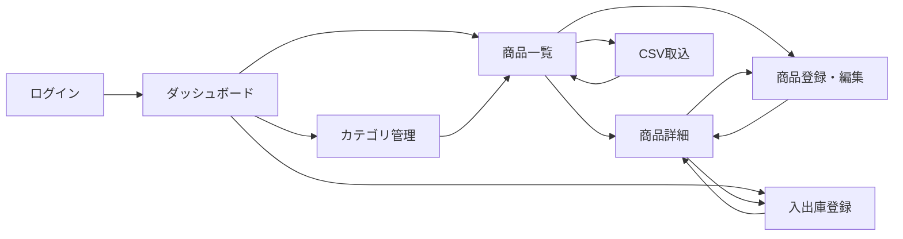
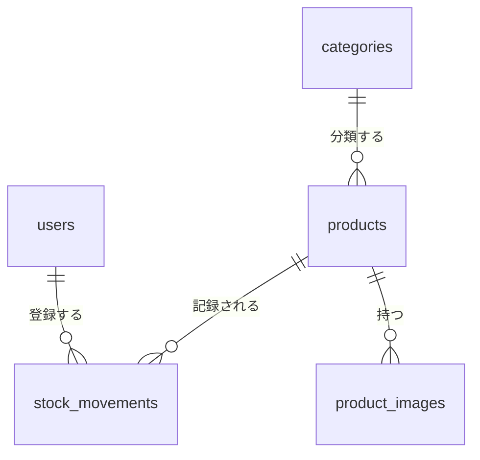
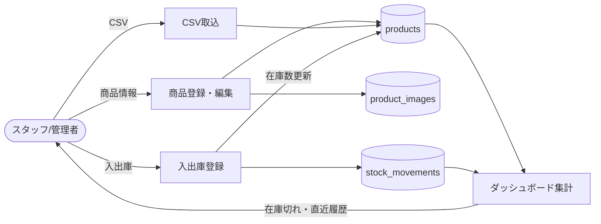

# 商品管理システム 仕様書

## 1. 概要

小規模 EC／店舗向けの商品管理システム。管理者が商品・カテゴリ・在庫を登録・更新し、入出庫の履歴を追跡できる。

### 1.1 対象ユーザー

| ロール | 説明 | 権限 |
| --- | --- | --- |
| 管理者 | システム全体の管理者 | 全機能、ユーザー管理 |
| スタッフ | 商品・在庫を扱う担当者 | 商品・カテゴリ・在庫の参照／登録／更新（削除不可） |

### 1.2 対象外

- 受注・決済・配送
- 複数倉庫の在庫管理
- 外部 EC サイトとの連携

## 2. 機能一覧

| ID | 機能 | 概要 |
| --- | --- | --- |
| F-01 | ログイン／ログアウト | メールアドレスとパスワードで認証 |
| F-02 | ダッシュボード | 商品数、在庫切れ件数、直近の入出庫を表示 |
| F-03 | 商品一覧・検索 | キーワード、カテゴリ、公開状態で絞り込み。ページング（20 件／ページ） |
| F-04 | 商品登録・編集 | 商品情報と画像を登録・更新 |
| F-05 | 商品削除 | 論理削除（管理者のみ） |
| F-06 | カテゴリ管理 | カテゴリの一覧／登録／編集／削除 |
| F-07 | 在庫入出庫 | 入庫・出庫・棚卸調整を登録し、在庫数を更新 |
| F-08 | 在庫履歴 | 商品ごとの入出庫履歴を表示 |
| F-09 | CSV 取込・出力 | 商品を CSV で一括登録・出力 |
| F-10 | ユーザー管理 | ユーザーの登録／編集／無効化（管理者のみ） |

## 3. 画面一覧

| ID | 画面名 | 主な内容 | 遷移先 |
| --- | --- | --- | --- |
| S-01 | ログイン | メール、パスワード、ログインボタン | S-02 |
| S-02 | ダッシュボード | 集計カード、在庫切れ商品リスト、直近の入出庫 | S-03, S-06, S-07 |
| S-03 | 商品一覧 | 検索条件、商品テーブル、新規登録／CSV ボタン | S-04, S-05, S-09 |
| S-04 | 商品詳細 | 商品情報、画像、現在在庫、在庫履歴（F-08） | S-05, S-07 |
| S-05 | 商品登録・編集 | 入力フォーム、保存／キャンセル | S-04 |
| S-06 | カテゴリ管理 | カテゴリ一覧、インライン編集、追加 | S-03 |
| S-07 | 入出庫登録 | 商品選択、区分（入庫／出庫／調整）、数量、メモ | S-04 |
| S-08 | ユーザー管理 | ユーザー一覧、登録／編集ダイアログ | ― |
| S-09 | CSV 取込 | ファイル選択、プレビュー、エラー行表示、取込実行 | S-03 |

共通ヘッダーのメニューから、S-02／S-03／S-06／S-07／S-08 へ移動できる（S-08 は管理者のみ表示）。

### 3.1 画面遷移

## 4. データモデル

### 4.1 ER 図

### 4.2 テーブル定義

**users（ユーザー）**

| カラム | 型 | 必須 | 説明 |
| --- | --- | --- | --- |
| id | bigint | ○ | PK |
| name | varchar(50) | ○ | 氏名 |
| email | varchar(255) | ○ | ログイン ID（一意） |
| password_hash | varchar(255) | ○ | パスワードハッシュ |
| role | varchar(10) | ○ | `admin` / `staff` |
| is_active | boolean | ○ | 有効フラグ |
| created_at / updated_at | timestamp | ○ | |

**categories（カテゴリ）**

| カラム | 型 | 必須 | 説明 |
| --- | --- | --- | --- |
| id | bigint | ○ | PK |
| name | varchar(50) | ○ | カテゴリ名（一意） |
| sort_order | int | ○ | 表示順 |
| created_at / updated_at | timestamp | ○ | |

**products（商品）**

| カラム | 型 | 必須 | 説明 |
| --- | --- | --- | --- |
| id | bigint | ○ | PK |
| sku | varchar(32) | ○ | 商品コード（一意） |
| name | varchar(100) | ○ | 商品名 |
| category_id | bigint | | FK → categories.id |
| price | int | ○ | 販売価格（税込、円、0 以上） |
| description | text | | 説明 |
| status | varchar(10) | ○ | `draft` / `published` / `archived` |
| stock_quantity | int | ○ | 現在在庫数（0 以上） |
| low_stock_threshold | int | ○ | 在庫少アラートの閾値（初期値 5） |
| deleted_at | timestamp | | 論理削除日時 |
| created_at / updated_at | timestamp | ○ | |

**product_images（商品画像）**

| カラム | 型 | 必須 | 説明 |
| --- | --- | --- | --- |
| id | bigint | ○ | PK |
| product_id | bigint | ○ | FK → products.id |
| url | varchar(500) | ○ | 画像 URL |
| sort_order | int | ○ | 表示順（0 がメイン画像） |

**stock_movements（入出庫履歴）**

| カラム | 型 | 必須 | 説明 |
| --- | --- | --- | --- |
| id | bigint | ○ | PK |
| product_id | bigint | ○ | FK → products.id |
| type | varchar(10) | ○ | `in`（入庫）/ `out`（出庫）/ `adjust`（調整） |
| quantity | int | ○ | 数量（in/out は正数、adjust は増減値） |
| quantity_after | int | ○ | 登録後の在庫数 |
| note | varchar(255) | | メモ |
| user_id | bigint | ○ | FK → users.id（登録者） |
| created_at | timestamp | ○ | 登録日時 |

## 5. 業務ルール

### 5.1 商品

- SKU は英数字とハイフンのみ、重複不可。登録後は変更できない。
- `published` にするには、商品名・価格・カテゴリ・画像 1 枚以上が必要。
- 削除は論理削除とし、一覧・検索には表示しない。入出庫履歴は残す。
- 画像は 1 商品 5 枚まで。JPEG / PNG、1 枚 5MB 以下。

### 5.2 在庫

- 在庫数は入出庫登録でのみ変更する（商品編集画面からは変更できない）。
- 出庫によって在庫数が 0 未満になる場合はエラーとする。
- 入出庫登録と `products.stock_quantity` の更新は同一トランザクションで行う。
- 在庫数が `low_stock_threshold` 以下になった商品を「在庫少」、0 の商品を「在庫切れ」としてダッシュボードに表示する。

### 5.3 カテゴリ

- 商品が紐づいているカテゴリは削除できない。

### 5.4 CSV 取込

- 文字コードは UTF-8（BOM 可）。1 回 1,000 行まで。
- 列：`sku, name, category_name, price, status, description`
- 既存 SKU は更新、新規 SKU は登録とする。在庫数は取り込まない。
- 1 行でもエラーがあれば全件取り込まず、エラー行と理由を表示する。

## 6. データフロー

## 7. 非機能要件

| 項目 | 内容 |
| --- | --- |
| 規模 | 商品 10,000 件、同時利用 20 ユーザー程度 |
| 性能 | 一覧・検索の応答 1 秒以内 |
| 認証 | セッション認証。30 分無操作でログアウト。パスワードは 8 文字以上 |
| 監査 | 商品の作成・更新・削除について、操作者と日時を記録 |
| 対応ブラウザ | Chrome / Edge / Safari の最新版 |
